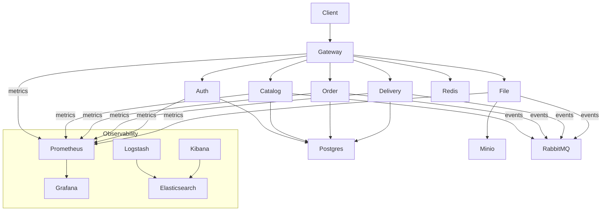

# Arquitectura de DeliveryApp

La plataforma se compone de varios microservicios escritos en Spring Boot. Cada servicio expone APIs REST reactivas y se despliega con Docker Compose junto a los componentes de infraestructura necesarios.

Cada flecha describe las interacciones principales entre los servicios y la infraestructura. El `gateway-service` actúa como punto de entrada y aplica filtros de autenticación para redirigir a los demás microservicios. Estos se apoyan en PostgreSQL para persistencia, RabbitMQ para mensajería y MinIO (o S3 en producción) para almacenamiento de archivos. La monitorización se realiza con Prometheus y Grafana, mientras que la observabilidad de logs se gestiona con la pila ELK.
